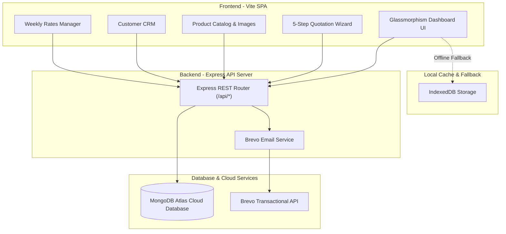

# ⚡ Skyland Energy — Pakistan Solar Quotation System


> A modern, full-stack sales quotation and product price catalog built for **Skyland Energy**. It streamlines the solar sales workflow—from reusable panel, inverter, battery, accessory, and service selection to customer management, server-verified totals, PDF generation, WhatsApp messaging, and cloud email dispatch through Brevo.

---

## 🌟 Key Highlights & Features

- 📊 **Account-Scoped Cloud Data**: Express and MongoDB remain the source of truth. React Query caches safe reads in memory, cancels stale requests, and clears all account data at logout.
- ⚡ **Capacity-Driven Quotation Generator**: Enter 10 kW, 50 kW, 1 MW, or another nominal size, choose equipment companies, and automatically calculate panel quantities, compatible inverter combinations, battery storage, installation BOQ, and commercial totals. A permission-controlled manual builder remains available.
- 🛠️ **Complete Installation Scope**: Add structure, protection, cabling, earthing, labour, design, testing, commissioning, transport and optional prosumer/DISCO coordination in one click.
- 🤝 **Commercial Controls**: Configurable payment milestones, delivery timeline, product and workmanship warranties, regulatory notes, and server-verified totals.
- 🔐 **Individual Team Access**: Super Admins can grant or revoke product editing/deletion, price-list access, customer and quotation management, proposal sending, and quotation settings for each manager or employee independently. Changes invalidate existing sessions immediately.
- 🚀 **Fast Route Loading**: Page-level code splitting keeps the initial Vercel browser bundle smaller and loads feature screens on demand.
- 🧾 **No Stock Tracking**: The product area is a reusable price catalog. It does not maintain inventory quantities or stock movements.
- 📦 **Product Catalog Management**: Dynamic grid view supporting solar panels, inverters (on-grid/hybrid), batteries, structures, cables, and accessories with image compression and upload handling.
- 👥 **Customer CRM**: Complete customer lifecycle management with WhatsApp one-click contact links, search, filtering, and project classification (Residential / Commercial / Industrial).
- 📄 **Branded PDF Generation**: Instant client-side A4 PDF proposal creation matching official Skyland Energy corporate templates.
- ✉️ **Brevo Transactional Email API**: Direct email dispatch of formatted solar proposals to clients.
- 💬 **WhatsApp Web API Integration**: Send pre-formatted quotation summaries directly to customer numbers.
- 📈 **Weekly Rates Management**: Inline editable pricing table for solar panels (with auto ₨/W calculation), inverters, and lithium batteries with bulk save options.
- 🎨 **Premium Responsive UI**: React and TypeScript components engineered around Skyland's dark navy and solar orange identity, with desktop tables, mobile record cards, accessible dialogs, loading skeletons, and actionable errors.

---

## 🛠️ Tech Stack

### **Frontend**

- **Core**: React 19, TypeScript, React Router, TanStack Query, React Hook Form, Zod and Radix UI
- **Build Tool**: Vite v6
- **Routing**: Browser history routes with Vercel SPA fallback; the prior UI remains available temporarily with `?ui=legacy`
- **PDF Engine**: `html2pdf.js` / `html2canvas`
- **Caching**: Account-scoped in-memory query cache with timeouts, request cancellation, deduplication and safe retries

### **Backend & Database**

- **Runtime**: Node.js
- **Framework**: Express v5
- **Database**: MongoDB Atlas Cloud
- **ORM**: Mongoose v9
- **Email Service**: Brevo (Sendinblue) Transactional API SDK
- **Utilities**: `dotenv`, `cors`, `concurrently`

---

## 🏗️ System Architecture



---

## 📸 Application Preview

|                 Dashboard & Stats                 |                  Product Catalog                   |
| :-----------------------------------------------: | :------------------------------------------------: |
| Animated metrics, revenue pipeline, recent quotes | Category filtering, search, unit price & rate/watt |

|                        5-Step Quotation Builder                        |           Rates Management           |
| :--------------------------------------------------------------------: | :----------------------------------: |
| Project profile, equipment, installation scope, commercials & proposal | Weekly panel & inverter rate updates |

---

## 📁 Repository Structure

```
Skyland Quotation System/
├── .env.example                       # Environment variables template
├── vercel.json                        # Vercel deployment configuration
├── server/                            # Node.js + Express Backend Server
│   ├── index.js                       # Server entry point & middleware
│   ├── db.js                          # Mongoose connection to MongoDB Atlas
│   ├── seed.js                        # Database auto-seeder
│   ├── models/                        # Mongoose Data Schemas
│   │   ├── Product.js
│   │   ├── Customer.js
│   │   ├── Quotation.js
│   │   └── Setting.js
│   └── routes/                        # Express API Endpoints
│       ├── products.js
│       ├── customers.js
│       ├── quotations.js
│       ├── settings.js
│       └── email.js                   # Brevo Email router
├── api/
│   └── index.js                       # Serverless entry point for Vercel
├── src/                               # Frontend Single Page App
│   ├── main.js                        # Application bootstrap
│   ├── router.js                      # SPA hash routing
│   ├── db/database.js                 # API Client with IndexedDB cache fallback
│   ├── components/                    # UI Components (Sidebar, Modal, Toast, Icons)
│   ├── pages/                         # Application Views
│   │   ├── dashboard.js
│   │   ├── products.js
│   │   ├── customers.js
│   │   ├── quotation-builder.js
│   │   ├── quotations.js
│   │   ├── rates.js
│   │   └── settings.js
│   ├── styles/                        # Modular CSS Design System
│   └── utils/                         # PDF, WhatsApp, and Helper utilities
```

---

## 🚀 Quick Start (Local Setup)

### **Prerequisites**

- Node.js v18+ and npm installed
- MongoDB Atlas Database URI
- Brevo API Key (Optional, for email dispatch)

### **Installation**

1. **Clone Repository**

   ```bash
   git clone https://github.com/Isfarakbar/Skyland-Quotation-System.git
   cd Skyland-Quotation-System
   ```

2. **Install Dependencies**

   ```bash
   npm install
   ```

3. **Configure Environment Variables**
   Create a `.env` file in the root directory:

   ```env
   MONGODB_URI=your_mongodb_atlas_connection_string
   BREVO_API_KEY=your_brevo_api_key
   SUPER_ADMIN_PASSWORD=use_a_unique_strong_password
   CLOUDINARY_CLOUD_NAME=your_cloud_name
   CLOUDINARY_API_KEY=your_numeric_api_key
   CLOUDINARY_API_SECRET=your_api_secret
   PORT=5000
   ```

4. **Run Concurrently (Backend + Frontend)**
   ```bash
   npm run dev
   ```
   - **Frontend UI**: `http://localhost:5173`
   - **Express API**: `http://localhost:5000`

---

## 🌐 Production Deployment

### **Deploying to Vercel**

This repository is pre-configured with `vercel.json` and `api/index.js` for zero-configuration Vercel deployment:

1. Import the repository into [Vercel](https://vercel.com).
2. Add every required value from `.env.example` in Vercel project settings. Authentication uses hashed opaque sessions in MongoDB; no client-readable JWT secret is required.
3. Set `BOOTSTRAP_ON_START=1` only for the first controlled deployment, sign in with the bootstrap super-admin account, then remove both `BOOTSTRAP_ON_START` and `SUPER_ADMIN_PASSWORD` and redeploy.
4. Run `npm run migrate:dry` against a backed-up production database, review the record counts, then run `npm run migrate:apply` once. The migration is idempotent, backfills automatic-sizing metadata, and adds missing supported equipment without deleting existing records.
5. Rotate any Cloudinary or authentication secrets that have ever been pasted into a chat or committed elsewhere. Store replacement secrets only in Vercel environment settings and redeploy to invalidate old sessions.

The application has four roles: `super_admin`, `admin`, `manager`, and `employee`. Public signup only permits manager and employee requests; neither can sign in until the super admin approves the registration.

### Verification

Run the complete production build, isolated MongoDB integration suite, server syntax checks, and dependency audit before deployment:

```bash
npm run check
npm audit --omit=dev
```

The integration suite verifies registration approval, role permissions, revocable sessions, settings boundaries, server-side quotation totals, employee ownership isolation, pagination, approval/revision workflows, duplicate references, and linked-record deletion protection.

### Safe rollout and rollback

The React interface is the default. Add `?ui=legacy` to a URL during the transition if a route must be compared with the previous interface. Do not enable `BOOTSTRAP_ON_START` during normal serverless cold starts.

---

## 📄 API Reference

| Method    | Endpoint                        | Description                                             |
| :-------- | :------------------------------ | :------------------------------------------------------ |
| `GET`     | `/api/products`                 | Retrieve all product catalog items                      |
| `POST`    | `/api/products`                 | Create a new product                                    |
| `PUT`     | `/api/products/:id`             | Update product details or price                         |
| `DELETE`  | `/api/products/:id`             | Remove product                                          |
| `GET`     | `/api/customers`                | Fetch customer directory                                |
| `POST`    | `/api/customers`                | Add new customer record                                 |
| `GET`     | `/api/quotations`               | List all quotations                                     |
| `POST`    | `/api/quotations`               | Save new quotation proposal                             |
| `GET`     | `/api/quotation-engine/options` | List compatible panel, inverter, and battery companies  |
| `POST`    | `/api/quotation-engine/preview` | Generate a server-validated automatic quotation preview |
| `GET/PUT` | `/api/quotation-engine/rules`   | Read or manage protected sizing and BOQ rules           |
| `POST`    | `/api/email/send-quotation`     | Dispatch proposal via Brevo Email API                   |

---

## 🤝 Author & Acknowledgments

- **Developed for**: Skyland Energy Sales Team
- **Repository**: [Isfarakbar/Skyland-Quotation-System](https://github.com/Isfarakbar/Skyland-Quotation-System)
- **License**: MIT License
