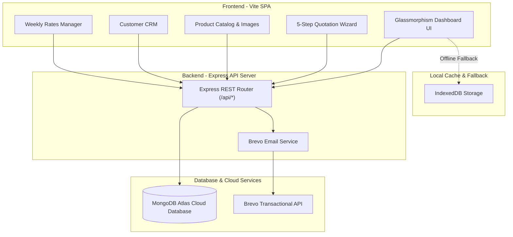

# ⚡ Skyland Energy — Solar Sales Quotation & Inventory Management System


> A modern, full-stack, enterprise-grade Sales Quotation & Inventory Management System built for **Skyland Energy**. Designed to streamline the solar sales workflow—from product inventory and customer relationship management to automated 16-item Bill of Quantities (BOQ) calculations, PDF generation, WhatsApp messaging, and cloud email dispatch via Brevo API.

---

## 🌟 Key Highlights & Features

- 📊 **Real-Time Cloud Persistence**: Full backend powered by **Express** and **MongoDB Atlas** (`Mongoose` ORM) with automatic client-side IndexedDB caching for offline resilience.
- ⚡ **Automated BOQ Quotation Builder**: 5-step wizard that auto-populates 16 standard BOQ line items, auto-calculates solar panel counts from system size (kW), computes subtotal, discounts, grand totals, and per-watt rates.
- 📦 **Product Catalog Management**: Dynamic grid view supporting solar panels, inverters (on-grid/hybrid), batteries, structures, cables, and accessories with image compression and upload handling.
- 👥 **Customer CRM**: Complete customer lifecycle management with WhatsApp one-click contact links, search, filtering, and project classification (Residential / Commercial / Industrial).
- 📄 **Branded PDF Generation**: Instant client-side A4 PDF proposal creation matching official Skyland Energy corporate templates.
- ✉️ **Brevo Transactional Email API**: Direct email dispatch of formatted solar proposals to clients.
- 💬 **WhatsApp Web API Integration**: Send pre-formatted quotation summaries directly to customer numbers.
- 📈 **Weekly Rates Management**: Inline editable pricing table for solar panels (with auto ₨/W calculation), inverters, and lithium batteries with bulk save options.
- 🎨 **State-of-the-Art Glassmorphism UI**: Bespoke CSS design system engineered around Skyland's brand identity (`#073d72` Sapphire Blue & `#fa4c0a` Solar Orange).

---

## 🛠️ Tech Stack

### **Frontend**
- **Core**: Vanilla JavaScript (ES6+), HTML5, Custom CSS3 Design System
- **Build Tool**: Vite v6
- **Routing**: Client-side Hash Router (SPA)
- **PDF Engine**: `html2pdf.js` / `html2canvas`
- **Offline Storage**: IndexedDB via `idb`

### **Backend & Database**
- **Runtime**: Node.js
- **Framework**: Express v5
- **Database**: MongoDB Atlas Cloud
- **ORM**: Mongoose v9
- **Email Service**: Brevo (Sendinblue) Transactional API SDK
- **Utilities**: `dotenv`, `cors`, `concurrently`

---

## 🏗️ System Architecture



---

## 📸 Application Preview

| Dashboard & Stats | Product Catalog |
|:---:|:---:|
| Animated metrics, revenue pipeline, recent quotes | Category filtering, search, unit price & rate/watt |

| 5-Step Quotation Builder | Rates Management |
|:---:|:---:|
| BOQ auto-calculations, pricing, terms & preview | Weekly panel & inverter rate updates |

---

## 📁 Repository Structure

```
Skyland Quotation System/
├── .env.example                       # Environment variables template
├── vercel.json                        # Vercel deployment configuration
├── server/                            # Node.js + Express Backend Server
│   ├── index.js                       # Server entry point & middleware
│   ├── db.js                          # Mongoose connection to MongoDB Atlas
│   ├── seed.js                        # Database auto-seeder
│   ├── models/                        # Mongoose Data Schemas
│   │   ├── Product.js
│   │   ├── Customer.js
│   │   ├── Quotation.js
│   │   └── Setting.js
│   └── routes/                        # Express API Endpoints
│       ├── products.js
│       ├── customers.js
│       ├── quotations.js
│       ├── settings.js
│       └── email.js                   # Brevo Email router
├── api/
│   └── index.js                       # Serverless entry point for Vercel
├── src/                               # Frontend Single Page App
│   ├── main.js                        # Application bootstrap
│   ├── router.js                      # SPA hash routing
│   ├── db/database.js                 # API Client with IndexedDB cache fallback
│   ├── components/                    # UI Components (Sidebar, Modal, Toast, Icons)
│   ├── pages/                         # Application Views
│   │   ├── dashboard.js
│   │   ├── products.js
│   │   ├── customers.js
│   │   ├── quotation-builder.js
│   │   ├── quotations.js
│   │   ├── rates.js
│   │   └── settings.js
│   ├── styles/                        # Modular CSS Design System
│   └── utils/                         # PDF, WhatsApp, and Helper utilities
```

---

## 🚀 Quick Start (Local Setup)

### **Prerequisites**
- Node.js v18+ and npm installed
- MongoDB Atlas Database URI
- Brevo API Key (Optional, for email dispatch)

### **Installation**

1. **Clone Repository**
   ```bash
   git clone https://github.com/Isfarakbar/Skyland-Quotation-System.git
   cd Skyland-Quotation-System
   ```

2. **Install Dependencies**
   ```bash
   npm install
   ```

3. **Configure Environment Variables**
   Create a `.env` file in the root directory:
   ```env
   MONGODB_URI=your_mongodb_atlas_connection_string
   BREVO_API_KEY=your_brevo_api_key
   PORT=5000
   ```

4. **Run Concurrently (Backend + Frontend)**
   ```bash
   npm run dev
   ```
   - **Frontend UI**: `http://localhost:3000`
   - **Express API**: `http://localhost:5000`

---

## 🌐 Production Deployment

### **Deploying to Vercel**

This repository is pre-configured with `vercel.json` and `api/index.js` for zero-configuration Vercel deployment:

1. Import the repository into [Vercel](https://vercel.com).
2. Add Environment Variables in Vercel project settings:
   - `MONGODB_URI`
   - `BREVO_API_KEY`
3. Click **Deploy**.

---

## 📄 API Reference

| Method | Endpoint | Description |
|:---|:---|:---|
| `GET` | `/api/products` | Retrieve all inventory products |
| `POST` | `/api/products` | Create a new product |
| `PUT` | `/api/products/:id` | Update product details or price |
| `DELETE` | `/api/products/:id` | Remove product |
| `GET` | `/api/customers` | Fetch customer directory |
| `POST` | `/api/customers` | Add new customer record |
| `GET` | `/api/quotations` | List all quotations |
| `POST` | `/api/quotations` | Save new quotation proposal |
| `POST` | `/api/email/send-quotation` | Dispatch proposal via Brevo Email API |

---

## 🤝 Author & Acknowledgments

- **Developed for**: Skyland Energy Sales Team
- **Repository**: [Isfarakbar/Skyland-Quotation-System](https://github.com/Isfarakbar/Skyland-Quotation-System)
- **License**: MIT License
